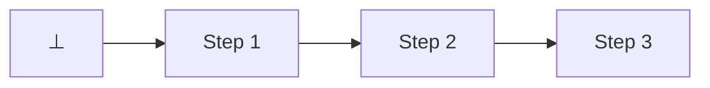
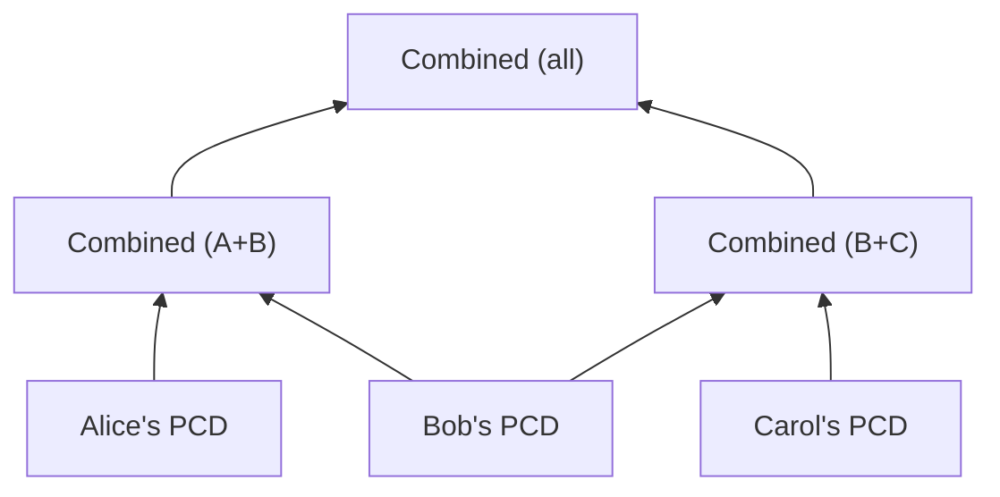

# Proof-carrying data

In traditional
[verifiable computation](https://en.wikipedia.org/wiki/Verifiable_computing),
a [SNARK](../appendix/snarks.md) is attached to a piece of data as a
one-shot attestation that a specified program was executed correctly on it.
**Proof-carrying data (PCD)** takes this further by organizing computation
around a _transition predicate_ that governs how data may evolve: at each step,
one or more prior PCD instances are consumed and a new instance is produced,
ensuring both that the predicate was satisfied _and_ that the consumed instances
were themselves valid. By induction, the resulting proof certifies the entire
computational history—hence the data truly _carries_ its own proof.

Incrementally verifiable computation (**IVC**), introduced by [Valiant
[Val08]](https://iacr.org/archive/tcc2008/49480001/49480001.pdf), is a
restricted form of this idea in which each step consumes a single predecessor,
forming a linear chain that terminates at some initial base case $\nil$:

The notable distinction of IVC over traditional verifiable computation is its
incremental nature. Intermediate data or state need not persist: each new proof
is constructed only from its predecessor and a fresh witness for the transition
predicate. Crucially, the proof remains constant-size regardless of how much
computation it captures.

IVC's linear structure suffices for sequential computations, but many real-world
scenarios involve combining results from parallel or independent computations.
PCD, [formalized [CT10]](http://people.csail.mit.edu/tromer/papers/pcd.pdf) by
Chiesa and Tromer, generalizes IVC by allowing each step to consume _multiple_
predecessors. The computational history thus becomes a directed acyclic graph
where predecessors need not share a common history. Further, independent
subcomputations can be performed by separate parties in parallel and later
combined:

## Expressing Computation with `Header`s {#headers}

Practical realizations of PCD express data and predicates through [arithmetic
circuits] rather than the more natural computational model that applications
typically work within. Ragu uses [gadgets] to represent data in this constrained
environment. PCD allows data to evolve according to transition predicates, and
distinct stages will usually require different gadgets.

Ragu provides a built-in abstraction, the [`Header`] trait, which allows
applications to define these distinct states. Headers specify their own
[`Output`] gadget type that represents the data certified at a given point in
the computation graph. Further, each header provides a unique [`Suffix`]
discriminant, allowing them to be distinguished based on their semantic value.

Applications will usually have their own (far richer) representation of the
underlying data than what is encoded in the form of a gadget, particularly
because it is more efficient for protocols and arithmetic circuits to reason
about information through the use of succinct descriptions like [cryptographic
commitments]. Therefore, [`Header`] also provides a method to [`encode`]
application-defined [`Data`] into the gadget representation of a header.

## Defining Transitions with `Step`s {#steps}

[`Header`]s represent the state at each node in the computation graph, but
applications also need a way to specify the predicates that govern how one state
evolves into another. Applications describe these transitions in Ragu using the
[`Step`] trait, which specifies the input and output header types for every
transition.

The non-uniform circuit model allows the prover to select any [`Step`] when
constructing PCD, so long as the constraints are satisfied, while paying only
the cost of applying the chosen [`Step`]. This is distinct from a traditional
PCD model where a single transition predicate encapsulates the evolution between
every two computational states, which either becomes costly to express or places
limitations on the way native computations are translated into PCD.

Ragu supports this multi-functionality model as a native part of the underlying
protocol, rather than simulating this flexibility through shims or other ad-hoc
approaches common in many earlier real-world PCD implementations. As a result,
Ragu allows applications to decompose complex logic across many specialized
[`Step`] implementations, rather than encoding all functionality into individual
large [`Step`]s.

## Evolving Headers with Fusion

PCD constructions can theoretically implement separate mechanisms for handling
IVC-style semantics, base cases, and $k$-arity transition predicates. Ragu keeps
things simple by representing all nodes in the computational graph as $2$-arity
transformations, enforcing a strict (but possibly unbalanced) binary tree
structure for all computations.

Therefore, all nodes in the computation graph involve taking two input PCD
instances and applying a [`Step`] (using some witness data) to certify a new
(`Header`) state. We call this user-facing operation [`fuse`] to distinguish it
from other overloaded terms like "folding" which conflict with related technical
ideas.

However, as with any PCD construction, there must exist a base case of the
recursive statement: the computation graph must have leaves that do not
represent a transition from prior certified data, since no predecessor can exist
by definition. Ragu handles this base case by allowing the two child PCD
instances of any node to be invalid so long as they carry trivial data that
represents no prior computational effort.

Ragu provides a built-in implementation of [`Header`] for the unit type `()` to
signify this trivial state. In order to lift non-trivial data into the
computational graph, applications specify a [`Step`] over these trivial states
and use a special [`seed`] function to transform a leaf state into valid PCD.

## Succinctness and Rerandomization

During fuse operations, the PCD instances being fused contain large proof
strings because these proofs do not ordinarily take the form of a succinct
proof. We refer to this as its **uncompressed** mode. With extra computational
effort, it is possible to create a **compressed** proof that is orders of
magnitude smaller and cheaper to verify. Due to the extra cost, compression (and
the decompression needed to prepare a compressed proof for future fusion) should
be avoided except at the necessary boundaries of application logic, such as when
succinct proofs must be communicated to third parties.

In its uncompressed form, it is possible to [`rerandomize`] PCD. This process
produces a proof string that reveals nothing about the initial PCD beyond the
certified data. Without rerandomization, a proof string (whether compressed or
not) may leak information such as witness data; proofs are not zero-knowledge by
default.

[`Header`]: ragu_pcd::header::Header
[`Data`]: ragu_pcd::header::Header::Data
[`Output`]: ragu_pcd::header::Header::Output
[`encode`]: ragu_pcd::header::Header::encode
[`Suffix`]: ragu_pcd::header::Suffix
[arithmetic circuits]: https://en.wikipedia.org/wiki/Arithmetic_circuit_complexity
[gadgets]: ../guide/gadgets/index.md
[`Step`]: ragu_pcd::step::Step
[`seed`]: ragu_pcd::Application::seed
[`fuse`]: ragu_pcd::Application::fuse
[cryptographic commitments]: https://en.wikipedia.org/wiki/Commitment_scheme
[`rerandomize`]: ragu_pcd::Application::rerandomize
