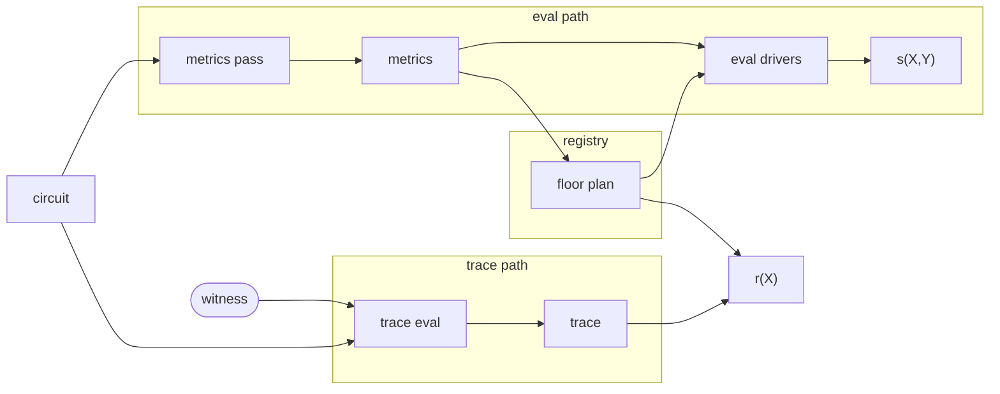

# Routines

[Routines](../guide/routines.md) are self-contained portions of circuit code
that satisfy a simple function-like interface: they take a single [`Input`]
gadget and a [`Driver`] handle, and return a single [`Output`] gadget. They are
permitted to do anything that normal circuit code can do with a
[driver](../guide/drivers/index.md), such as making gates ([`gate`], [`mul`],
[`alloc`]) and constraining their wires ([`enforce_zero`]).

It is possible to invoke them by manually calling their [`Routine::execute`]
method, but this almost always defeats the purpose of the abstraction. Instead,
they are meant to be invoked through the [`Driver::routine`] method, which
preserves the context and boundaries of routine invocations for the driver.

Routines can also further invoke other routines, creating **nested routines**.
To avoid complicated call stack management, our drivers only keep _routine-local_
states. When circuit code calls [`Driver::routine`], the driver saves its local
scoped state (e.g., running wire monomial evaluations for `sx::Evaluator`,
constraint counters for `metric::Counter` etc.), and initializes a fresh scope
for the child routine. On return, the parent scope is restored and the child's
contribution is rolled up in the parent's accumulated state. The `DriverScope`
trait provides a `with_scope` helper that automates this save-then-restore; some
drivers use manual `mem::replace` on the scoped state instead when they need to
inspect the child scope's result before restoring.
We refer our invocation-depth-independent drivers as being _context insensitive_.

```admonish info
Drivers do not learn the [`TypeId`] of a [`Routine`] they are asked to `execute`,
since [`Routine`] does not implement [`Any`] / `'static`. Even if they could
learn this, routines of the same type are allowed to diverge in their actual
behavior because they can be arbitrarily configured, so long as they remain
deterministic.
```

Drivers cannot distinguish routines themselves but merely their **invocations**;
in each `routine` call, they learn the [`TypeId`] of their [`Input`] and
[`Output`] gadgets, and thanks to
[fungibility](../guide/gadgets/index.md#fungibility) this is very
useful for their structural analysis (via [conversions]) and induces stable
algebraic properties at routine boundaries.

## Algebraic Description {#algebraic-description}

Routines exploit the fact that contiguous sections of code tend to have
algebraically convenient structure in the resulting wiring polynomial $s(X, Y)$:

* [`gate`] advances an $i$ counter and returns $(X^{2n - 1 - i}, X^{2n + i}, X^{4n - 1 - i}, X^i)$ wires.
* `enforce_zero` advances a counter $j$ and adds a fresh linear combination of previous wires multiplied by $Y^j$.

Most constraints within a routine only involve wires created within the routine.
For a routine that starts at gate index $i$ and constraint index $j$, these
constraints, constituting the **internal contribution** to $s(X, Y)$, can be
written as:

$$
Y^j \Big( X^i \, g_1(X, Y) + X^{-i} \, g_2(X^{-1}, Y) \Big)
$$

where $X^i Y^j$ (and $X^{-i} Y^j$ for wires allocated in reversed segments of a
[structured](../../protocol/prelim/structured_vectors.md) trace) are the common
factors extracted from all monomial terms in the contribution[^factoring].
Crucially, $g_1$ and $g_2$ are **invariant to the routine invocation**: they are
the same regardless of where or how many times the invocation is placed in a
circuit. This makes _routine memoization_ possible: given a invocation cache hit,
we only need to apply a **repositioning** by re-scaling them to the starting
position ($X^i Y^j$ and $X^{-i} Y^j$) of that particular invocation.

[^factoring]: Every wire allocated _after_ entering the routine at gate index $i$
    has a positional monomial $X^{i+k}$ or $X^{-{i+k}}$ (reversed segment) for
    some $k>0$. Each constraint on these internal wires is a linear combination
    of these positional monomials multiplied by $Y^{j+\ell}$ for some $\ell > 0$.
    Thus, the internal contribution, summing over all $Y$-power-scaled linear
    combination of $X$ monomials, share a common factor $X^i Y^j$
    (or $X^{-i}Y^j$). Extracting these factors yield $g_1$ and $g_2$.

The overall contribution of a routine invocation to $s(X, Y)$ is the sum of this
internal contribution, an **interface contribution** from constraints that
reference wires created outside the routine (e.g., input gadget wires), and a
**system contribution** from constraints that reference system wires (i.e.,
`ONE`) at fixed locations.

The interface contribution cannot be factored (or memoized) the same way:
the input gadget is allocated by the routine caller at an unknown position, both
absolute and relative to the start of the routine, so there is no a priori $X^i$
factors to extract. We must compute interface contributions per-invocation.
One crucial complication arises from nested routines. Our decision on
_context-insensitive_ drivers demands that the output gadgets of nested/child
routines are also part of the interface contribution of the parent routine.

Meanwhile, system contributions are also memoizable:

$$
\sum_{\ell \in T} Y^\ell X^{2n} = X^{2n}Y^j \cdot g_3(Y)
$$

where $T$ is the set of constraint indices within the routine where system wires
are referenced, $X^{2n}$ is the monomial for the $b_0 (= 1)$ wire during
[wiring checks](../../protocol/local/wiring.md#layout).
Similarly, we can extract the common factor $X^{2n}Y^j$ for the starting
constraint index $j$ and the remaining univariate $g_3$ is invariant to the
routine invocation.

## Pipeline {#pipeline}



Ragu learns about invocations by executing circuit code in an analysis pass that
collects metrics about each routine invocation. Because circuit synthesis is
deterministic, invocations appear in a canonical **DFS order** during
synthesis. Each invocation's position in that order is its **DFS index**. The
metrics can reliably identify each invocation by this index for the benefit of
future execution of the same circuit code.

All of the metrics for every wiring polynomial added to the registry are fed
into a **floor planner** that is responsible for making scheduling and
relocation decisions in advance of future circuit operations, such as wiring
polynomial evaluation or trace polynomial assembly. The floor planner's goal is
to maximize the optimization opportunities of those operations, usually by
rearranging the wiring polynomials of the circuits in some way. The result
is a floor plan, which is maintained by the registry.

The wiring polynomial evaluators use the floor plan to properly align and
memoize arithmetic to reduce the cost of evaluating the registry polynomial. The
trace polynomial assembly process produces an unassembled trace of execution for
a given witness, and the registry uses the floor plan to translate this to the
actual trace polynomial $r(X)$.

## Invocations

Because synthesis is deterministic, invocations appear in a canonical **DFS
order** that is stable across executions of the same circuit code. The
metrics pass, wiring polynomial evaluators, and trace evaluator all see the
same sequence. The floor plan is indexed by this order: `floor_plan[i]`
describes where the $i$-th segment is placed, regardless of whether a
future floor planner reorders their positions.

The `Counter` uses each invocation to build a [`SegmentRecord`] and a
[`MemoFingerprint`]. It resets its geometric sequences and Horner
accumulator to a fixed initial state — independent of the caller — so that
the fingerprint captures only the routine's internal constraint structure.
Input wires are remapped into the fresh scope without incrementing
constraint counts, seeding the sequences for the fingerprint but not
inflating metrics. After execution, the child's Horner result and
constraint counts are bundled into the fingerprint. Output wires are then
remapped back into the parent's sequence space; the `available_d` pairing
slot is saved and restored around this remap to keep the parent's
allocation parity aligned with the real evaluation drivers.

The wiring polynomial evaluators ([`sxy`]; [`sx`] and [`sy`] follow the
same structural protocol with different accumulation targets) use the floor
plan to jump each routine to its absolute position in the polynomial. The
child scope's running monomials are initialized at the segment's absolute
gate offset so that constraints land at the correct position in
$s(X, Y)$. After execution, assertions verify that the child consumed
exactly the gate and constraint counts declared by the floor plan. The
routine's local Horner result is then scaled by the segment's absolute
$Y$-offset, combined with any nested child contributions, and added to
the parent's accumulator.

The trace evaluator branches on the [`Prediction`] returned by `predict`.
[`Unknown`] predictions are executed in-line within the current evaluator
via `with_scope`. [`Known`] predictions allow the driver to take the
predicted output and defer actual execution: with multicore enabled, the
routine is spawned into a parallel task that sends its segments back
through a channel; without multicore, it is evaluated inline and its
segments are collected into a deferred buffer. In both cases, segments are
annotated with their **DFS path** — the sequence of routine-call indices
from root to the segment — so that the final `finish` step can sort all
segments back into canonical DFS order.

[`sxy`]: ragu_circuits::s::sxy
[`sx`]: ragu_circuits::s::sx
[`sy`]: ragu_circuits::s::sy
[`SegmentRecord`]: ragu_circuits::metrics::SegmentRecord
[`Prediction`]: ragu_core::routines::Prediction
[`Known`]: ragu_core::routines::Prediction::Known
[`Unknown`]: ragu_core::routines::Prediction::Unknown

## Segments

Execution traces are divided into **segments**. All wires allocated outside of
routine invocations belong to a single **root segment**.[^root-segment] Each
routine invocation creates a new segment containing only the wires allocated
directly within it; nested calls produce their own segments in turn. The
`CircuitExt::trace` method produces a `Trace` that contains these segments in DFS
order, but their actual arrangement in the trace polynomial depends on the floor
plan's repositioning values.

[^root-segment]: The root segment is not repositioned. It contains the special
    `ONE` wire and is where all stage wires are located.

Each segment has its own [contribution](#algebraic-description) to $s(X, Y)$. A
leaf routine invocation — one with no nested calls — contributes exactly one
segment. When a routine nests further calls, its **total contribution** is the
sum of its own segment's contribution and every descendant segment's. These
segments are not independent: routines send and receive wires through [`Input`]
and [`Output`] gadgets, and those wires are often allocated in different
segments.

Because each wire's location in $s(X, Y)$ is a monomial in $X$ determined by the
gate offset of whichever segment allocated it, a constraint referencing a
foreign wire creates a positional dependency between the two segments. A routine
invocation and all of its descendants thus form a **subtree** of
positionally-dependent segments. If every segment in a subtree sits at a fixed
relative offset from the root, all wire locations shift uniformly — the subtree
is a single relocatable unit that can be memoized. If the floor planner
positions descendants independently, cross-segment wire locations introduce
additional positional degrees of freedom and the subtree must be handled
per-segment.

### Allocation

Allocation allows gates to be reused as a source of wire values. The allocator
state (parity and gate index) are stashed whenever a routine is invoked. This
prevents allocation state from crossing segment boundaries, which would
contaminate their contributions and interfere with repositioning and
memoization.

```admonish info
As an optimization, it is theoretically possible for routine invocations to be
inlined so that they effectively take place within their parent's segment. This
decision could be encoded into the floor plan. However, this would require the
trace computation to be aware of this decision (affecting the pipeline above) or
would require additional metadata to be stored in the `Trace` for adjustment
during assembly. **As a simplification, we assume all routine invocations are
out-of-line.**
```

## Memoization

The [algebraic description](#algebraic-description) decomposes a routine's
contribution into **internal** polynomials $g_1(X, Y), g_2(X^{-1}, Y)$ that
depend only on the routine's constraint structure, and **interface** terms that
depend on wires crossing the routine boundary. Memoization caches the internal
part: if two invocations produce the same constraint structure, their $g_1$ and
$g_2$ are identical and can be reused. The interface terms and
[repositioning](#repositioning) factors $X^i, Y^j$ must still be computed
per-invocation.

### Fingerprinting

Two invocations are structurally equivalent when they share a
[**routine fingerprint**][`RoutineFingerprint`]: the Schwartz–Zippel evaluation
scalar and the local gate and constraint counts. The
[metrics pass](#pipeline) computes a fingerprint for each invocation by
executing its constraint logic on a lightweight `Counter` driver that
substitutes independent geometric sequences for wire values and accumulates
constraint contributions via Horner's rule. If the resulting scalar and counts
match, the two invocations are structurally equivalent with overwhelming
probability.

Fingerprints capture only the **local** constraint structure. When entering a
routine, the `Counter` resets its geometric sequences and Horner accumulator to
a fixed initial state, and output wires from nested routine calls are remapped
to fresh positions in the caller's sequence space. This ensures the fingerprint
is independent of calling context and of any sub-routines the routine invokes.

### Routine vs. Memo Fingerprints

The [`TypeId`] pairs `(Input, Output)` do not affect what a segment
contributes to $s(X, Y)$. Two routines with different Rust types but the
same constraint structure — the same Schwartz–Zippel scalar and the same
gate and constraint counts — produce identical polynomial contributions.
This can be verified directly: wrap each routine in a circuit and assert
that their $s(x, y)$ evaluations agree at random points.

For floor planning, only the polynomial contribution matters. A
[`RoutineFingerprint`] `(eval, local_num_gates, local_num_constraints)`
suffices to group segments with the same polynomial shape; [`TypeId`]
pairs are deliberately excluded so that the floor planner can group
type-distinct routines that contribute identically. For memoization, the
constraints are stricter: a cached routine must be safely substitutable
for a fresh execution, which requires matching output wire mappings and
recursive subtree structure. A [`MemoFingerprint`] extends the routine
fingerprint with `output_eval` (a scalar encoding the output wire
mapping) and a recursive `deep` hash that folds in [`TypeId`] pairs, all
routine fingerprint fields, the child count, and each child's deep hash.
The floor planner keys on the routine fingerprint; the memo cache keys on
the memo fingerprint.

The distinction is semantic, not just organizational. A routine
fingerprint captures **segment-level equivalence**: whether two individual
segments impose the same local constraints and could be aligned in the
polynomial layout regardless of their subtrees — for instance, padding
one circuit's segment against another circuit's offset. A memo
fingerprint captures **subtree-level equivalence**: whether entire routine
invocations are interchangeable and can be substituted via memoization.
A segment can be routine-equivalent to another (same local constraints,
worth aligning) but memo-inequivalent (different children, so the
cached subtree cannot be reused). Consolidating both levels into a single
identity type loses this distinction and forces the floor planner to
treat segments as different when only their subtrees differ.

The two-level design avoids four conflation risks that arise when a single
fingerprint type serves both roles. First, [`TypeId`] pairs do not affect
what a segment contributes to $s(X, Y)$, so including them in the
polynomial-equivalence key would prevent the floor planner from grouping
type-distinct routines that contribute identically. Second, tests that
assert "different TypeIds ⇒ different fingerprints" are testing memoization
safety, not polynomial correctness; naming them as if TypeIds were
necessary for fingerprint correctness obscures which invariant is actually
being verified. Third, the `Counter` and the wiring polynomial evaluators
compute fundamentally different things — a context-independent structural
hash versus an actual polynomial contribution — so bundling both concerns
into one type hides the boundary between them. Fourth, without an
independent reference evaluation to compare against, a memoization cache
that silently returns wrong results could go undetected; the separation
makes it possible to test polynomial equivalence (via
[`RoutineFingerprint`]) and memoization substitutability (via
[`MemoFingerprint`]) with distinct, targeted assertions.

### Repositioning {#repositioning}

Each segment occupies a **non-overlapping** range of gates and constraints in
the polynomial layout, assigned by the floor planner. Currently, the floor
planner preserves DFS synthesis order and computes offsets via a simple prefix
sum, but a future implementation could reorder segments to co-locate equivalent
routines or improve memory access patterns. The only constraint is that the root
segment remains pinned at the polynomial origin (both offsets zero), and
no two segments may overlap.

### Testability

Because segments are non-overlapping, bugs in the floor planner or
memoization logic produce observable failures rather than silent
corruption. If segments were assigned overlapping gate ranges, the
`Trace::assemble` scatter step would overwrite values from one segment
with another's, and the post-execution assertions in the wiring polynomial
evaluators — which verify that each segment consumed exactly the gate and
constraint counts declared by the floor plan — would fire. A memoization
error manifests differently: a cached internal contribution that disagrees
with the fresh computation produces a different $s(x, y)$ value, and
because the final evaluation is a single field element, any discrepancy is
detectable by comparison. Incorrect repositioning rescaling shifts a
routine's contribution to the wrong polynomial position, breaking the
relationship between $s(X, Y)$ and $r(X)$, which verification catches as
a polynomial identity failure.

These failure modes are all covered by a single reference comparison. The
native evaluation path computes the registry polynomial $m(w, x, y)$ by
evaluating each circuit's $s(x, y)$ independently with no caching. The
memoized path shares a cache across circuits: on the first evaluation of
a routine at a given canonical position, the contribution and output
wires are stored; subsequent circuits with the same fingerprint at that
position reuse the cached contribution, rescaled by the floor plan's
repositioning factors. Asserting that both paths agree at random
$(w, x, y)$ points covers floor planning, repositioning, and cache logic
in a single check. The non-overlapping invariant
ensures that any disagreement is a real bug rather than a masking
coincidence. Because the native path does not depend on the
fingerprinting model at all, this comparison catches errors in the model
itself — a routine fingerprint that over-groups, or a memo fingerprint
that omits a necessary field — not only bugs in the memoization code.

[`RoutineFingerprint`]: ragu_circuits::metrics::RoutineFingerprint
[`MemoFingerprint`]: ragu_circuits::metrics::MemoFingerprint
[`TypeId`]: core::any::TypeId
[`Routine`]: ragu_core::routines::Routine
[`Driver`]: ragu_core::drivers::Driver
[`Driver::routine`]: ragu_core::drivers::Driver::routine
[`Input`]: ragu_core::routines::Routine::Input
[`Output`]: ragu_core::routines::Routine::Output
[`Routine::execute`]: ragu_core::routines::Routine::execute
[`enforce_zero`]: ragu_core::drivers::Driver::enforce_zero
[`gate`]: ragu_core::drivers::DriverTypes::gate
[`mul`]: ragu_core::drivers::Driver::mul
[`alloc`]: ragu_core::drivers::Driver::alloc
[`Any`]: core::any::Any
[conversions]: ../guide/gadgets/conversion.md
