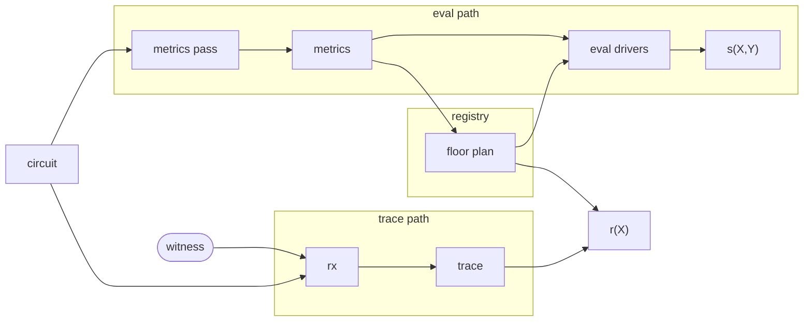

# Routines

[Routines](../guide/routines.md) are self-contained portions of circuit code
that satisfy a simple function-like interface: they take a single [`Input`]
gadget and a [`Driver`] handle, and return a single [`Output`] gadget. They are
permitted to do anything that normal circuit code can do with a
[driver](../guide/drivers/index.md), such as making gates ([`gate`], [`mul`],
[`alloc`]) and constraining their wires ([`enforce_zero`]).

It is possible to invoke them by manually calling their [`Routine::execute`]
method, but this almost always defeats the purpose of the abstraction. Instead,
they are meant to be invoked through the [`Driver::routine`] method, which hands
control and visibility of its execution to the driver.

```admonish info
Drivers do not learn the [`TypeId`] of a [`Routine`] they are asked to `execute`,
since [`Routine`] does not implement [`Any`] / `'static`. Even if they could
learn this, routines of the same type are allowed to diverge in their actual
behavior because they can be arbitrarily configured, so long as they remain
deterministic.
```

Drivers cannot distinguish routines themselves but merely their **invocations**;
in each `routine` call, they learn the [`TypeId`] of their [`Input`] and
[`Output`] gadgets, and thanks to
[fungibility](../guide/gadgets/index.md#fungibility) this is very
useful for their structural analysis (via [conversions]) and induces stable
algebraic properties at routine boundaries.

## Algebraic Description {#algebraic-description}

Routines exploit the fact that contiguous sections of code tend to have
algebraically convenient structure in the resulting wiring polynomial $s(X, Y)$:

* [`gate`] advances an $i$ counter and returns $(X^{2n - 1 - i}, X^{2n + i}, X^{4n - 1 - i}, X^i)$ wires.
* `enforce_zero` advances a counter $j$ and adds a fresh linear combination of previous wires multiplied by $Y^j$.

Most of the linear constraints created within a routine consist purely of wires
created within that routine, meaning that the **internal** contribution of a
routine can be written as polynomials $g_x, g_{x^{-1}}$ and memoized if the
routine is invoked multiple times. Given a cache hit, we need only scale $g_x$
and $g_{x^{-1}}$ by powers of $Y^j X^i$ (or $Y^j X^{-i}$) to obtain the correct
internal $s(X, Y)$ for an equivalent invocation.

The **interface** contribution to $s(X, Y)$ involves wires created outside the
routine, such as the input gadget wires or the fixed `ONE` wire. This is less
amenable to memoization because these wires can vary between invocations; we
must generally maintain separate polynomials $h_\ell$ for every interface wire.

Taken together, the **contribution** of a routine invocation to $s(X, Y)$ can be
written as

$$
Y^j \Big( X^i g_x + X^{-i} g_{x^{-1}} + \sum_\ell h_\ell \Big)
$$

for some **repositioning** values $i, j$.

## Pipeline {#pipeline}



Ragu learns about invocations by executing circuit code in an analysis pass that
collects metrics about each routine invocation. Because circuit synthesis is
deterministic, invocations appear in a canonical **DFS order** during
synthesis. Each invocation's position in that order is its **DFS index**. The
metrics can reliably identify each invocation by this index for the benefit of
future execution of the same circuit code.

All of the metrics for every wiring polynomial added to the registry are fed
into a **floor planner** that is responsible for making scheduling and
relocation decisions in advance of future circuit operations, such as wiring
polynomial evaluation or trace polynomial assembly. The floor planner's goal is
to maximize the optimization opportunities of those operations, usually by
rearranging the wiring polynomials of the circuits in some way. The result
is a floor plan, which is maintained by the registry.

The wiring polynomial evaluators use the floor plan to properly align and
memoize arithmetic to reduce the cost of evaluating the registry polynomial. The
trace polynomial assembly process produces an unassembled trace of execution for
a given witness, and the registry uses the floor plan to translate this to the
actual trace polynomial $r(X)$.

## Invocations

When circuit code calls [`Driver::routine`], the driver saves its current
scoped state — running wire monomials, constraint counters, Horner
accumulators, allocation pairing state — and initializes a fresh scope
for the child routine. On return, the parent scope is restored and the
child's contribution is folded into the parent's accumulated result. The
[`DriverScope`] trait provides a `with_scope` helper that automates this
save/restore; some drivers use manual `mem::replace` instead when they
need to inspect the child scope's result before restoring the parent.

Because synthesis is deterministic, invocations appear in a canonical **DFS
order** that is stable across executions of the same circuit code. The
metrics pass, wiring polynomial evaluators, and trace evaluator all see the
same sequence. The floor plan is indexed by this order: `floor_plan[i]`
describes where the $i$-th segment is placed, regardless of whether a
future floor planner reorders their positions.

The [`Counter`] uses each invocation to build a [`SegmentRecord`] and a
[`RoutineFingerprint`]. It resets its geometric sequences and Horner
accumulator to a fixed initial state — independent of the caller — so that
the fingerprint captures only the routine's internal constraint structure.
Input wires are remapped into the fresh scope without incrementing
constraint counts, seeding the sequences for the fingerprint but not
inflating metrics. After execution, the child's Horner result and
constraint counts are bundled into the fingerprint. Output wires are then
remapped back into the parent's sequence space; the `available_d` pairing
slot is saved and restored around this remap to keep the parent's
allocation parity aligned with the real evaluation drivers.

The wiring polynomial evaluators ([`sxy`]; [`sx`] and [`sy`] follow the
same structural protocol with different accumulation targets) use the floor
plan to jump each routine to its absolute position in the polynomial. The
child scope's running monomials are initialized at the segment's absolute
gate offset so that constraints land at the correct position in
$s(X, Y)$. After execution, assertions verify that the child consumed
exactly the gate and constraint counts declared by the floor plan. The
routine's local Horner result is then scaled by the segment's absolute
$Y$-offset, combined with any nested child contributions, and added to
the parent's accumulator.

The trace evaluator branches on the [`Prediction`] returned by `predict`.
[`Unknown`] predictions are executed in-line within the current evaluator
via `with_scope`. [`Known`] predictions allow the driver to take the
predicted output and defer actual execution: with multicore enabled, the
routine is spawned into a parallel task that sends its segments back
through a channel; without multicore, it is evaluated inline and its
segments are collected into a deferred buffer. In both cases, segments are
annotated with their **DFS path** — the sequence of routine-call indices
from root to the segment — so that the final `finish` step can sort all
segments back into canonical DFS order.

[`DriverScope`]: ragu_circuits::DriverScope
[`sxy`]: ragu_circuits::s::sxy
[`sx`]: ragu_circuits::s::sx
[`sy`]: ragu_circuits::s::sy
[`Counter`]: ragu_circuits::metrics::Counter
[`SegmentRecord`]: ragu_circuits::metrics::SegmentRecord
[`Prediction`]: ragu_core::routines::Prediction
[`Known`]: ragu_core::routines::Prediction::Known
[`Unknown`]: ragu_core::routines::Prediction::Unknown

## Segments

Execution traces are divided into **segments**. All wires allocated outside of
routine invocations belong to a single **root segment**.[^root-segment] Each
routine invocation creates a new segment containing only the wires allocated
directly within it; nested calls produce their own segments in turn. The
`CircuitExt::rx` method produces a `Trace` that contains these segments in DFS
order, but their actual arrangement in the trace polynomial depends on the floor
plan's repositioning values.

[^root-segment]: The root segment is not repositioned. It contains the special
    `ONE` wire and is where all stage wires are located.

Each segment has its own [contribution](#algebraic-description) to $s(X, Y)$. A
leaf routine invocation — one with no nested calls — contributes exactly one
segment. When a routine nests further calls, its **total contribution** is the
sum of its own segment's contribution and every descendant segment's. These
segments are not independent: routines send and receive wires through [`Input`]
and [`Output`] gadgets, and those wires are often allocated in different
segments.

Because each wire's location in $s(X, Y)$ is a monomial in $X$ determined by the
gate offset of whichever segment allocated it, a constraint referencing a
foreign wire creates a positional dependency between the two segments. A routine
invocation and all of its descendants thus form a **subtree** of
positionally-dependent segments. If every segment in a subtree sits at a fixed
relative offset from the root, all wire locations shift uniformly — the subtree
is a single relocatable unit that can be memoized. If the floor planner
positions descendants independently, cross-segment wire locations introduce
additional positional degrees of freedom and the subtree must be handled
per-segment.

### Allocation

Allocation allows gates to be reused as a source of wire values. The allocator
state (parity and gate index) are stashed whenever a routine is invoked. This
prevents allocation state from crossing segment boundaries, which would
contaminate their contributions and interfere with repositioning and
memoization.

```admonish info
As an optimization, it is theoretically possible for routine invocations to be
inlined so that they effectively take place within their parent's segment. This
decision could be encoded into the floor plan. However, this would require the
trace computation to be aware of this decision (affecting the pipeline above) or
would require additional metadata to be stored in the `Trace` for adjustment
during assembly. **As a simplification, we assume all routine invocations are
out-of-line.**
```

## Memoization

The [algebraic description](#algebraic-description) decomposes a routine's
contribution into **internal** polynomials $g_x, g_{x^{-1}}$ that depend only
on the routine's constraint structure, and **interface** terms $h_\ell$ that
depend on wires crossing the routine boundary. Memoization caches the internal
part: if two invocations produce the same constraint structure, their $g_x$ and
$g_{x^{-1}}$ are identical and can be reused. The interface terms and
[repositioning](#repositioning) factors $X^i, Y^j$ must still be computed
per-invocation.

### Fingerprinting

Two invocations are structurally equivalent when they share a
[**fingerprint**][`RoutineFingerprint`]: the pair `(TypeId(Input),
TypeId(Output))`, the Schwartz–Zippel evaluation scalar, and the local gate and
constraint counts. The [metrics pass](#pipeline) computes a fingerprint for each
invocation by executing its constraint logic on a lightweight [`Counter`] driver
that substitutes independent geometric sequences for wire values and
accumulates constraint contributions via Horner's rule. If the resulting scalar,
type pairs, and counts all match, the two invocations are structurally
equivalent with overwhelming probability.

Fingerprints capture only the **local** constraint structure. When entering a
routine, the `Counter` resets its geometric sequences and Horner accumulator to
a fixed initial state, and output wires from nested routine calls are remapped
to fresh positions in the caller's sequence space. This ensures the fingerprint
is independent of calling context and of any sub-routines the routine invokes.

### Shallow vs. Deep Fingerprints

The [`TypeId`] pairs `(Input, Output)` do not affect what a segment
contributes to $s(X, Y)$. Two routines with different Rust types but the
same constraint structure — the same Schwartz–Zippel scalar and the same
gate and constraint counts — produce identical polynomial contributions.
This can be verified directly: wrap each routine in a circuit and assert
that their $s(x, y)$ evaluations agree at random points.

For floor planning, only the polynomial contribution matters. A **shallow
fingerprint** `(eval, num_gates, num_constraints)` suffices to group
segments with the same polynomial shape; including [`TypeId`] pairs would
prevent the floor planner from grouping type-distinct routines that
contribute identically. For memoization, the constraints are stricter: a
cached routine must be safely substitutable for a fresh execution, which
requires matching output wire mappings and recursive subtree structure. A
**deep fingerprint** extends the shallow fingerprint with `output_eval`
(a scalar encoding the output wire mapping) and a recursive hash that
folds in [`TypeId`] pairs, all shallow fields, the child count, and each
child's deep hash. The floor planner keys on the shallow fingerprint; the
memo cache keys on the deep fingerprint.

The distinction is semantic, not just organizational. A shallow
fingerprint captures **segment-level equivalence**: whether two individual
segments impose the same local constraints and could be aligned in the
polynomial layout regardless of their subtrees — for instance, padding
one circuit's segment against another circuit's offset. A deep
fingerprint captures **subtree-level equivalence**: whether entire routine
invocations are interchangeable and can be substituted via memoization.
A segment can be shallow-equivalent to another (same local constraints,
worth aligning) but deep-inequivalent (different children, so the
cached subtree cannot be reused). Consolidating both levels into a single
identity type loses this distinction and forces the floor planner to
treat segments as different when only their subtrees differ.

### Repositioning {#repositioning}

Each segment occupies a **non-overlapping** range of gates and constraints in
the polynomial layout, assigned by the floor planner. Currently, the floor
planner preserves DFS synthesis order and computes offsets via a simple prefix
sum, but a future implementation could reorder segments to co-locate equivalent
routines or improve memory access patterns. The only constraint is that the root
segment remains pinned at the polynomial origin (both offsets zero), and
no two segments may overlap.

### Testability

Because segments are non-overlapping, bugs in the floor planner or
memoization logic produce observable failures rather than silent
corruption. If segments were assigned overlapping gate ranges, the
[`Trace::assemble`] scatter step would overwrite values from one segment
with another's, and the post-execution assertions in the wiring polynomial
evaluators — which verify that each segment consumed exactly the gate and
constraint counts declared by the floor plan — would fire. A memoization
error manifests differently: a cached internal contribution that disagrees
with the fresh computation produces a different $s(x, y)$ value, and
because the final evaluation is a single field element, any discrepancy is
detectable by comparison. Incorrect repositioning rescaling shifts a
routine's contribution to the wrong polynomial position, breaking the
relationship between $s(X, Y)$ and $r(X)$, which verification catches as
a polynomial identity failure.

These failure modes are all covered by a single reference comparison. The
native evaluation path computes the registry polynomial $m(w, x, y)$ by
evaluating each circuit's $s(x, y)$ independently with no caching. The
memoized path shares a cache across circuits: on the first evaluation of
a routine at a given canonical position, the contribution and output
wires are stored; subsequent circuits with the same fingerprint at that
position reuse the cached contribution, rescaled by the floor plan's
repositioning factors. Asserting that both paths agree at random
$(w, x, y)$ points covers floor planning, repositioning, and cache logic
in a single check. The non-overlapping invariant
ensures that any disagreement is a real bug rather than a masking
coincidence. Because the native path does not depend on the
fingerprinting model at all, this comparison catches errors in the model
itself — a shallow fingerprint that over-groups, or a deep fingerprint
that omits a necessary field — not only bugs in the memoization code.

[`RoutineFingerprint`]: ragu_circuits::metrics::RoutineFingerprint
[`Counter`]: ragu_circuits::metrics::Counter
[`Trace::assemble`]: ragu_circuits::trace::Trace::assemble
[`TypeId`]: core::any::TypeId
[`Routine`]: ragu_core::routines::Routine
[`Driver`]: ragu_core::drivers::Driver
[`Driver::routine`]: ragu_core::drivers::Driver::routine
[`Input`]: ragu_core::routines::Routine::Input
[`Output`]: ragu_core::routines::Routine::Output
[`Routine::execute`]: ragu_core::routines::Routine::execute
[`enforce_zero`]: ragu_core::drivers::Driver::enforce_zero
[`gate`]: ragu_core::drivers::DriverTypes::gate
[`mul`]: ragu_core::drivers::Driver::mul
[`alloc`]: ragu_core::drivers::Driver::alloc
[`Any`]: core::any::Any
[conversions]: ../guide/gadgets/conversion.md
