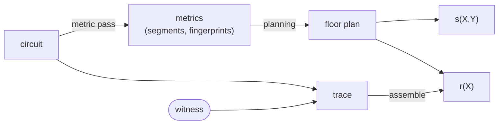

# Routines

[Routines](../guide/routines.md) are self-contained portions of circuit code
that satisfy a simple function-like interface: they take a single [`Input`]
gadget and a [`Driver`] handle, and return a single [`Output`] gadget. They are
permitted to do anything that normal circuit code can do with a
[driver](../guide/drivers/index.md), such as making gates ([`gate`], [`mul`],
[`alloc`]) and constraining their wires ([`enforce_zero`]).

It is possible to invoke them by manually calling their [`Routine::execute`]
method, but this almost always defeats the purpose of the abstraction. Instead,
they are meant to be invoked through the [`Driver::routine`] method, which
preserves the context and boundaries of routine invocations for the driver.

Routines can further invoke other routines, creating **nested routines**.
To avoid complicated call-stack management, drivers keep only _routine-local_
state. When circuit code calls [`Driver::routine`], the driver saves its
scoped state (e.g., running wire monomial evaluations for `sx::Evaluator`,
constraint counters for `metrics::Counter`), and initializes a fresh scope
for the child routine. On return, the parent scope is restored and the child's
contribution is folded into the parent's accumulated result. The `DriverScope`
trait provides a `with_scope` helper that automates this save-and-restore; some
drivers use manual `mem::replace` instead when they need to inspect the child
scope before restoring the parent.

Because driver behavior does not depend on invocation depth, we call them
_context insensitive_.

## Algebraic Description {#algebraic-description}

Routines exploit the fact that contiguous sections of code tend to have
algebraically convenient structure in the resulting wiring polynomial $s(X, Y)$:

* [`gate`] advances an $i$ counter and returns
  $(X^{2n - 1 - i}, X^{2n + i}, X^{4n - 1 - i}, X^i)$ wires.
* `enforce_zero` advances a counter $j$ and adds a fresh linear
  combination of previous wires multiplied by $Y^j$.

Most constraints within a routine involve only wires created within
that routine.
For a routine that starts at gate index $i$ and constraint index $j$, these
constraints, constituting the **internal contribution** to $s(X, Y)$, can be
written as:

$$
Y^j \Big( X^i \, g_1(X, Y) + X^{-i} \, g_2(X^{-1}, Y) \Big)
$$

where $X^i Y^j$ (and $X^{-i} Y^j$ for wires allocated in reversed segments of a
[structured](../protocol/prelim/structured_vectors.md) trace) are the common
factors extracted from all monomial terms in the contribution[^factoring].
Crucially, $g_1$ and $g_2$ are **invariant to the routine invocation**: they are
the same regardless of where or how many times the invocation is placed in a
circuit. This makes _routine memoization_ possible: given an invocation
cache hit, we only need to apply a **repositioning** by re-scaling to the
starting position ($X^i Y^j$ and $X^{-i} Y^j$) of that particular invocation.

[^factoring]: Every wire allocated within the routine, starting at gate
    index $i$, has a positional monomial $X^{i+k}$ or $X^{-(i+k)}$
    (reversed segment) for some $k\geq 0$. Each constraint on these
    internal wires is a linear combination of these positional monomials
    multiplied by $Y^{j+\ell}$ for some $\ell \geq 0$.
    The internal contribution — the sum of all $Y$-power-scaled linear
    combinations of $X$ monomials — therefore shares a common factor $X^i Y^j$
    (or $X^{-i}Y^j$). Extracting these factors yields $g_1$ and $g_2$.

The overall contribution of a routine invocation to $s(X, Y)$ is the sum of this
internal contribution, an **interface contribution** from constraints that
reference wires created outside the routine (e.g., input gadget wires), and a
**system contribution** from constraints that reference system wires (i.e.,
`ONE`) at fixed locations.

The interface contribution cannot be factored or memoized the same way:
the input gadget is allocated by the caller at an unknown position, both
absolute and relative to the start of the routine, so there are no a priori
$X^i$ factors to extract. Interface contributions must be computed
per-invocation.

A complication arises from nested routines. The context-insensitive design
requires that output gadgets of child routines are also treated as interface
contributions of the parent routine.
It is always safe to classify them this way and recompute on every invocation
of the parent.
However, if two parent routines are known to have identical sub-routines, the
output gadgets can be remapped to matching positions in the parent's context,
allowing further constraints on them to be memoized as internal contributions.
We elaborate on this [below](#memoization).

System contributions are memoizable by similar reasoning:

$$
\sum_{\ell \in T} Y^\ell X^{2n} = X^{2n}Y^j \cdot g_3(Y)
$$

where $T$ is the set of constraint indices within the routine where system wires
are referenced, $X^{2n}$ is the monomial for the $b_0 (= 1)$ wire during
[wiring checks](../protocol/local/wiring.md#layout).
The common factor $X^{2n}Y^j$ can be extracted for the starting constraint
index $j$, and the remaining univariate $g_3$ is again invariant to the
routine invocation: the relative offsets $\ell - j$ within the routine
depend only on its structure, not on the absolute starting index.

## Example: Synthesis Trace {#example}

The following circuit is a concrete example for all upcoming discussion:

```
 Circuit Synthesis Trace
 ────────────────────────
 ├─ r0
 ├─ Routine A
 │   └─ a0
 ├─ r1
 ├─ Routine B
 │   ├─ b0
 │   ├─ Routine A
 │   │   └─ a0
 │   └─ b1
 ├─ Routine B
 │   ├─ b2
 │   └─ Routine C
 │       └─ c0
 └─ r2
```

Each label `r0, a0, b0, …, r2` denotes a contiguous section of circuit trace
allocated via [`gate`]. At various points the circuit logic invokes a routine,
which may in turn invoke nested routines.

## Segments {#segments}

Given an execution trace, we need a global indexing of all sub-sections so
that different drivers can refer to them consistently. Ragu divides the trace
into **segments** and orders them in a canonical **DFS order** determined by
routine invocations. In particular, circuit sections at the same invocation
depth are merged into a single segment; wires allocated outside of any routine
belong to a special **root segment**.[^root-segment] Each routine invocation
creates a new **base segment** containing only the wires allocated directly
within it; nested calls produce their own segments in turn. The DFS-ordered
segments are built as [`SegmentRecord`]s during the [metric pass](#pipeline).
Because circuit synthesis is deterministic, the ordered sequence is stable
across all drivers of the same circuit code.

[^root-segment]: The root segment is never repositioned. It contains the special
    `ONE` wire and is where all stage wires of multi-stage circuits are located.

```
segments[0]: r0 + r1 + r2 (root segment)
segments[1]: a0           (base segment of Routine A)
segments[2]: b0 + b1      (base segment of Routine B)
segments[3]: a0           (in the nested Routine A invoked in Routine B)
segments[4]: b2           (base segment of the second invocation of Routine B)
segments[5]: c0           (base segment of Routine C)
```


## Routine Fingerprints {#fingerprint}

A prerequisite of routine memoization is identifying distinct routines.
Consider some naive but incorrect ways to identify one:

- by shape (`num_gates` and `num_constraints`):
  different routines can coincidentally share the same shape.
- by `(Input, Output)` gadget types:
  routines performing different operations (e.g. `square` and `double`)
  can share the same input/output types.
- by `TypeId::of::<Routine>()`: 
  routines can be [parameterized](../guide/routines.md#param) and stateful;
  even the same `ScaledTxz` routine type (or `RoutineB` in our example)
  can synthesize different traces depending on its configuration.
  
Drivers cannot distinguish routines statically but must also consider
their **invocations**. Fingerprinting is the process by which a routine
invocation is succinctly encapsulated so that _matching fingerprints imply
opportunities for routine memoization_. An invocation can carry multiple
fingerprints, each indicating a different memoization strategy or level of
aggressiveness. Ragu produces two: a **base fingerprint** that captures
_segment-level equivalence_ and enables memoization of only the base segment,
and a **deep fingerprint** that captures _tree-level equivalence_ and enables
memoization of the entire routine, recursively including all nested
sub-routines.

### Base fingerprint {#base-fingerprint}

Ragu tracks the gate and constraint counts of a routine invocation's base
segment, together with its polynomial contribution, as the `BaseFingerprint`.
In the [example above](#example), the two invocations of `RoutineB` are
structurally different, but the internal contributions of their base segments
may still be identical and thus memoizable (i.e., `b0 + b1 = b2`).

The polynomial contribution includes only the invocation's internal and system
contributions — those invariant to context and location — and excludes all
interface contributions. Polynomial evaluation alone is insufficient because it
captures only `enforce_zero` calls, not the gate count, which the floor planner
requires. The constraint count, already implicit in the contribution scalar, is
included purely as defense-in-depth.

```rust
struct BaseFingerprint {
    /// shape of the **base segment** of a routine
    num_gates: usize,
    num_constraints: usize,
    /// polynomial contribution of the base segment
    /// in practice, we use `low_u64<F>(eval) -> u64`
    eval: F,
}
```

Conceptually, the simplest approach to `eval` is to pick a random $(x_r, y_r)$
and use the internal contribution of each routine invocation to $s(x_r, y_r)$
as its fingerprint. By the Schwartz-Zippel lemma, two different invocations
produce different polynomial contributions with overwhelming probability.
However, this requires tracking monomial evaluations in both the forward
direction ($X^i$ terms) and the backward direction ($X^{4n-1-i}$ terms), and
involves scalar multiplications (for $X^{2n}$ and $X^{4n}$) and an expensive
inversion (for $X^{-1}$) during initialization.

Instead, Ragu uses a more efficient approach: four _independent_ geometric
sequences for wire values (one for each of the `a/b/c/d`-wires) and
Horner-accumulated contributions from `enforce_zero` constraints with $Y$ powers
of a random $Y=y_r$. Wires from the $i$-th gate correspond to
$(x_0^i, x_1^i, x_2^i, x_3^i)$ monomial evaluations for a random
$(x_0, x_1, x_2, x_3)$ picked at initialization. This simplification is possible
because the fingerprint need only characterize constraints in some binding way,
not necessarily in the same form as the wiring polynomial $s(X, Y)$.

Handling interface contributions is the most delicate part. In our example, the
first invocation of `RoutineB` accepts an input gadget from the parent on entry
and receives an output gadget from the child `RoutineA` during execution. Both
gadgets are allocated outside the scope of `RoutineB`'s base segment, so any
constraint involving them is an interface contribution and must not affect the
`eval` computation. Concretely, relocating wires in these interface gadgets must
not change the fingerprint.

There are two approaches to handling wires in interface gadgets:

1. Discriminate them as a separate wire type
   (e.g. `enum WireEval { Value, One, Interface }`) so that routines can flag
   them as `WireEval::Interface(F)` and drivers can drop their contribution.
2. Assign context-insensitive values to them so that their contributions cancel
   across otherwise-equivalent invocations and thus cannot affect the
   equivalence test.

Ragu takes the second approach, implemented via a wire remapping [`WireMap`]:
all wires in interface gadgets are remapped to values from an independent
geometric sequence with a separate random base.[^x-remap] Every routine,
regardless of invocation depth, re-initializes this sequence on entry so that
input gadget wires hold context-insensitive positional values. Before returning,
the routine remaps its output gadget wires and appends them to the parent's
sequence.

[^x-remap]: For code reference, the variable is named `x_remap` and remapped
    wires take on values `x_remap^i`, independent of the normal sequences
    $(x_0^i, x_1^i, x_2^i, x_3^i)$. Intuitively, every routine starts with a
    blank page for interface gadget wires, written sequentially from the start;
    output gadget wires are then appended to the parent's page.

### Deep fingerprint {#deep-fingerprint}

Deep-fingerprint memoization applies when two routine invocations are
tree-level equivalent: structurally identical in both their base segment and all
nested sub-routines. Two invocations with identical deep fingerprints have
matching shapes (gate and constraint counts) and matching polynomial
contributions when all nested sub-routines are _flattened and inlined_.

The gap from the [base fingerprint](#base-fingerprint) lies in how output
gadgets of child sub-routines are handled. In the base fingerprint, output wires
are remapped into the parent's context. This remapping erases their positions
relative to the start of the parent routine, which matters when testing
equivalence of the inlined routine.[^swapped] The deep fingerprint must
therefore capture the positional values of these output wires.

```rust
struct DeepFingerprint {
    base: BaseFingerprint,
    /// deep hash: 
    /// H(self.base, output_gadget, child_deep_hashes, input_type, output_type)
    deep: u64,
}
```

Ragu augments the base fingerprint with the wire values of the output gadget,
the deep fingerprints of all child invocations (one level deeper), and the
`TypeId` of the input and output gadget types (optional, defense-in-depth only).
The monomial evaluation of output wires already encodes their positions relative
to the start of the sub-routine, and thus transitively relative to the start of
the parent routine. Because the parent's deep fingerprint recursively folds in
the deep hashes of all children, the final hash binds the entire invocation
tree.


[^swapped]: As an example, suppose two `RoutineB` invocations each nest a call
    to `RoutineA`. The first `RoutineA` invocation runs
    `alloc(w1); alloc(w2); enforce_zero(w1 + w2); return (w1, w2)`;
    the second runs
    `alloc(w2); alloc(w1); enforce_zero(w1 + w2); return (w1, w2)`.
    In the `BaseFingerprint` computation, the output wires `(w1, w2)` from
    both invocations are mapped to the same values in their parent
    `RoutineB` context, so the two `RoutineB` invocations receive
    identical base fingerprints.
    However, after inlining, the invocations differ because of the swapped
    allocation order of `w1` and `w2`.

## Pipeline {#pipeline}



A **metric pass** executes the circuit on a lightweight `Counter` driver that
records the [segment](#segments) decomposition and computes a
[fingerprint](#fingerprint) for every routine invocation. The output is an
ordered sequence of [`SegmentRecord`]s — one per segment in DFS order — each
carrying local gate and constraint counts together with the invocation's base
and deep fingerprints. Because synthesis is deterministic, the sequence is
stable across all subsequent driver executions of the same circuit code.

The registry collects segment records from every circuit and feeds them into a
**floor planner** that assigns each segment a non-overlapping absolute position
`(gate_start, constraint_start)` in the polynomial layout. The floor planner
aligns segments with matching fingerprints to maximize
[memoization](#memoization) across the entire registry, both within and
between circuits: matching base fingerprints enable memoization of the
base segment's internal contribution, while matching deep fingerprints
enable memoization of entire routine subtrees. Currently, the floor
planner only rearranges segment placement; it does not perform
circuit-equivalence substitutions that would alter the circuit logic
itself.

The floor plan encodes this rearrangement and is an auxiliary input to
downstream drivers: the wiring polynomial evaluators use it to
[reposition](#algebraic-description) each segment's contribution to its
assigned offset in $s(X, Y)$, and the trace polynomial evaluator uses
it to scatter each segment's gate values to the correct range in
$r(X)$.

## Memoization {#memoization}

The [algebraic description](#algebraic-description) decomposes a routine
invocation's contribution to $s(X, Y)$ into **internal** polynomials $g_1(X, Y)$
and $g_2(X^{-1}, Y)$, a **system** polynomial $g_3(Y)$, and **interface** terms
that cross the routine boundary. The internal and system polynomials depend only
on the routine's constraint structure and are invariant to invocation context;
the interface terms depend on externally allocated wires and must be recomputed.
Memoization caches the invariant parts — $g_1$, $g_2$, and $g_3$ — and
replays them for subsequent invocations whose [fingerprints](#fingerprint)
match, applying fresh [repositioning](#algebraic-description) factors
$X^i$, $X^{-i}$, $Y^j$ to place the cached contribution at the correct
offset.

Caching follows $s(X, Y)$'s evaluation logic, not the simplified
computation used for [fingerprinting](#base-fingerprint). During
fingerprinting, interface wires receive context-insensitive values so
their contributions cancel across equivalent invocations (approach 2
[above](#base-fingerprint)). During memoization, the driver must
actually _exclude_ interface contributions from the cached result so
that only the invariant part is stored. This requires approach 1:
the wire type carries an `Interface` discriminant so that the driver
can identify interface terms in each constraint and route them to the
per-invocation computation rather than the cache.

The registry collects fingerprints from the [metric pass](#pipeline) and records
matches — both within a single circuit and across circuits — so that downstream
drivers (the wiring polynomial evaluator for $s(X, Y)$ and the trace evaluator
for $r(X)$) can determine on entry to each routine whether to record a fresh
contribution or replay a cached one.

How much of a routine can be cached depends on which fingerprint matches.

**Base-fingerprint memoization.** When two invocations share a
[base fingerprint](#base-fingerprint), only the _base segment_ of the routine is
known to be equivalent. The driver caches $g_1$, $g_2$, and $g_3$ for that
segment and repositions them at the new invocation's offset.
Contributions from nested sub-routines — including any constraints the
parent places on their output gadgets — remain interface contributions
and are recomputed per-invocation.

**Deep-fingerprint memoization.** When two invocations share a
[deep fingerprint](#deep-fingerprint), the entire invocation tree is equivalent:
the base segment _and_ all nested sub-routines have matching structure. This
changes what counts as an interface contribution: output gadgets of
child routines, which must be treated as interface contributions under
base-fingerprint memoization, can now be remapped to matching positions
within the parent's context. Constraints on these output wires become
part of the internal contribution and are memoizable along with the
rest of the subtree.

```admonish important title="Deep memoization redefines the internal contribution"
Under deep-fingerprint equivalence, the output wires of nested sub-routines are
no longer interface contributions — the deep fingerprint guarantees that child
routines produce structurally identical output at identical relative positions.
The parent can treat these wires as internal, collapsing the entire subtree into
a single memoizable unit. This is the key advantage of the deep fingerprint: it
enables full-tree memoization rather than segment-by-segment caching.
```

When matching fingerprints occur only _within_ a single circuit, memoization
requires nothing beyond caching and repositioning: the driver records the
contribution on the first invocation and rescales it for subsequent ones.
Alignment becomes relevant when matching fingerprints span _multiple_ circuits
in the registry.

### Inter-Circuit Alignment {#inter-circuit-alignment}

The registry polynomial combines per-circuit wiring polynomials via Lagrange
interpolation:

$$
m(w, x, y) = \sum_k \ell_k(w) \cdot s_k(x, y)
$$

where $\ell_k$ is the Lagrange basis polynomial for circuit $k$. Without
optimization, each circuit evaluates its routines independently and scales by
$\ell_k(w)$. If the floor planner places equivalent routines at the _same_
absolute position across circuits, their invariant contributions coincide and
can be factored:

$$
\Big(\sum_{k \in K} \ell_k(w)\Big) \cdot \big(X^i Y^j \cdot g(X, Y)\big)
$$

where $K$ is the set of circuits sharing the routine at that position
and $g$ denotes the combined invariant contribution. The routine's
contribution is computed once and multiplied by the sum of the relevant
Lagrange coefficients, rather than being recomputed per-circuit.

The floor planner prioritizes deep-fingerprint alignment for the largest
segments, since collapsing an entire subtree yields the greatest savings.
Alignment introduces implicit padding between segments in the global layout, but
this padding does not materialize in memory: all downstream drivers process
segments in a streaming fashion using absolute offsets from the floor plan, so
padded regions are either skipped or processed at negligible cost. The trace
polynomial $r(X)$ remains sparse, and padding does not increase the cost of the
polynomial commitment. Base-fingerprint alignment is also applied when the base
segment is large enough to justify the padding overhead.

### Testability

Because segments are non-overlapping, bugs in the floor planner or
memoization logic produce observable failures rather than silent
corruption. If segments were assigned overlapping gate ranges, the
`Trace::assemble` scatter step would overwrite values from one segment
with another's, and the post-execution assertions in the wiring polynomial
evaluators — which verify that each segment consumed exactly the gate and
constraint counts declared by the floor plan — would fire. A memoization
error manifests differently: a cached internal contribution that disagrees
with the fresh computation produces a different $s(x, y)$ value, and
because the final evaluation is a single field element, any discrepancy is
detectable by comparison. Incorrect repositioning shifts a routine's
contribution to the wrong polynomial position, breaking the
relationship between $s(X, Y)$ and
$r(X)$, which verification catches as a polynomial identity failure.

These failure modes are all covered by a single reference comparison. The
native evaluation path computes the registry polynomial $m(w, x, y)$ by
evaluating each circuit's $s(x, y)$ independently with no caching. The
memoized path shares a cache across circuits: on the first evaluation of
a routine at a given canonical position, the contribution and output
wires are stored; subsequent circuits with the same fingerprint at that
position reuse the cached contribution, rescaled by the floor plan's
repositioning factors. Asserting that both paths agree at random
$(w, x, y)$ points covers floor planning, repositioning, and cache logic
in a single check. The non-overlapping invariant
ensures that any disagreement is a real bug rather than a masking
coincidence. Because the native path does not depend on the
fingerprinting model at all, this comparison catches errors in the model
itself — a routine fingerprint that over-groups, or a memo fingerprint
that omits a necessary field — not only bugs in the memoization code.

[`WireMap`]: ragu_core::convert::WireMap
[`TypeId`]: core::any::TypeId
[`Routine`]: ragu_core::routines::Routine
[`Driver`]: ragu_core::drivers::Driver
[`Driver::routine`]: ragu_core::drivers::Driver::routine
[`Input`]: ragu_core::routines::Routine::Input
[`Output`]: ragu_core::routines::Routine::Output
[`Routine::execute`]: ragu_core::routines::Routine::execute
[`enforce_zero`]: ragu_core::drivers::Driver::enforce_zero
[`gate`]: ragu_core::drivers::DriverTypes::gate
[`mul`]: ragu_core::drivers::Driver::mul
[`alloc`]: ragu_core::drivers::Driver::alloc
[`SegmentRecord`]: ragu_circuits::metrics::SegmentRecord
[`Any`]: core::any::Any
[conversions]: ../guide/gadgets/conversion.md
